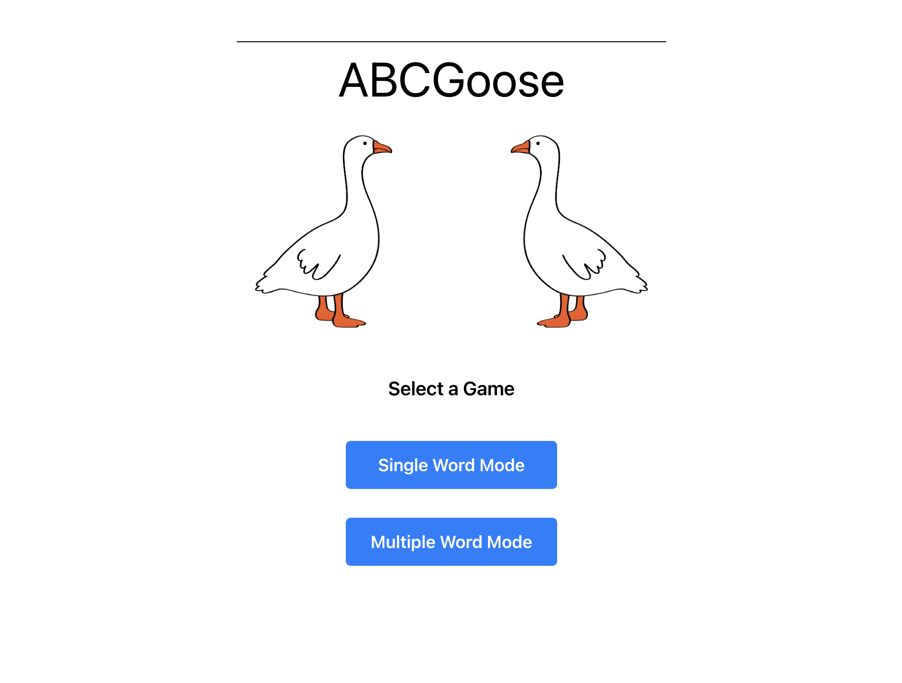
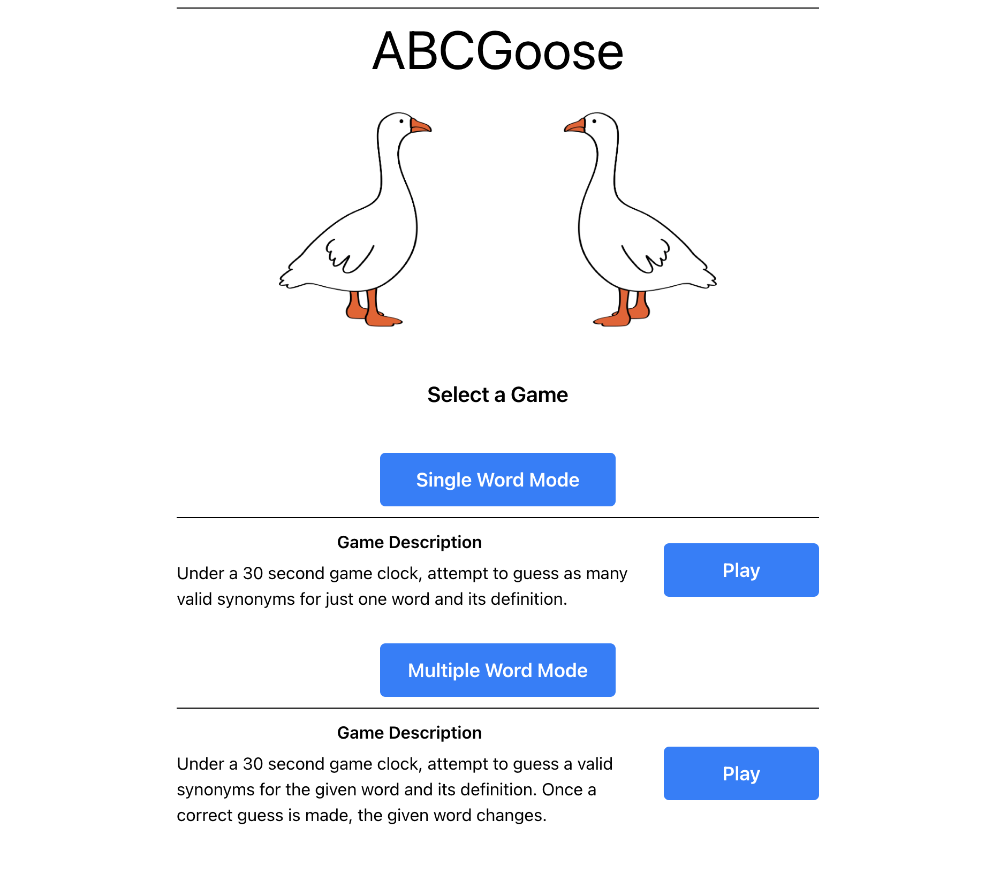
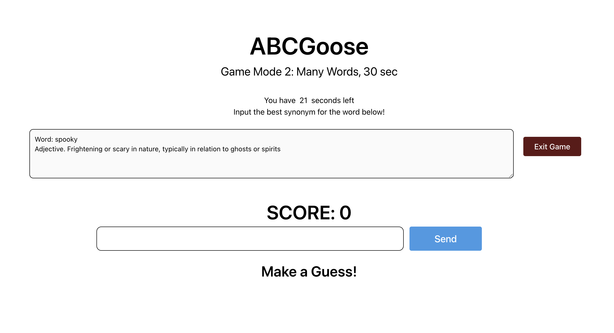
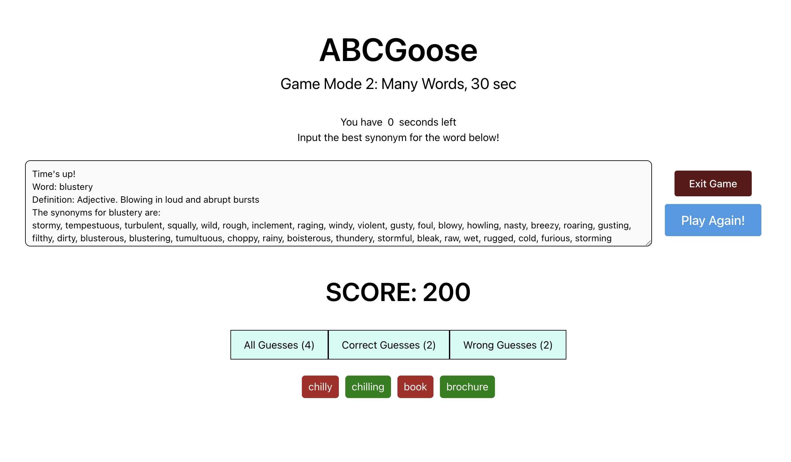
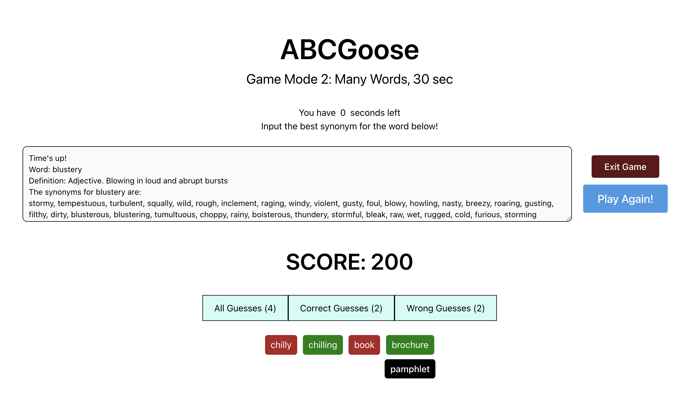

# How to Play:

There's a live website link now:
https://abcgoose.vercel.app/

## Screenshots:

    
    
    
    
    

## Tasks Completed:

- Converted to fast-rendering and clean React.js + Tailwind.css frontend (model-view-controller paradigm)
- Built webscraper to reliably find words, definitions, and synonyms
- Built secure backend API with Domain, SSL Certificate, and JWT token Auth to fetch game data
- Host backend on AWS EC2 and deploy frontend on Vercel

## TODO:

- Build a Machine Learning Verification Layer for user inputs
- Build more game modes (i.e., User manually changes the time limit)

## To clone and develop locally:

1. Clone the Repository
2. Ensure you have Python, npm, and React installed on your machine
3. Follow instructions below

### Running Backend

cd ABCGoose/database

#### Set up Virtual Environment

If you don't have the pip virtualenv package, do: pip install virtualenv

python3 -m venv venv

source venv/bin/activate

pip install -r requirements.txt

./runBackend.sh

### Running Frontend

Open another terminal shell\
cd ABCGoose/frontend/app \
npm start

4. Click the link generated by npm
