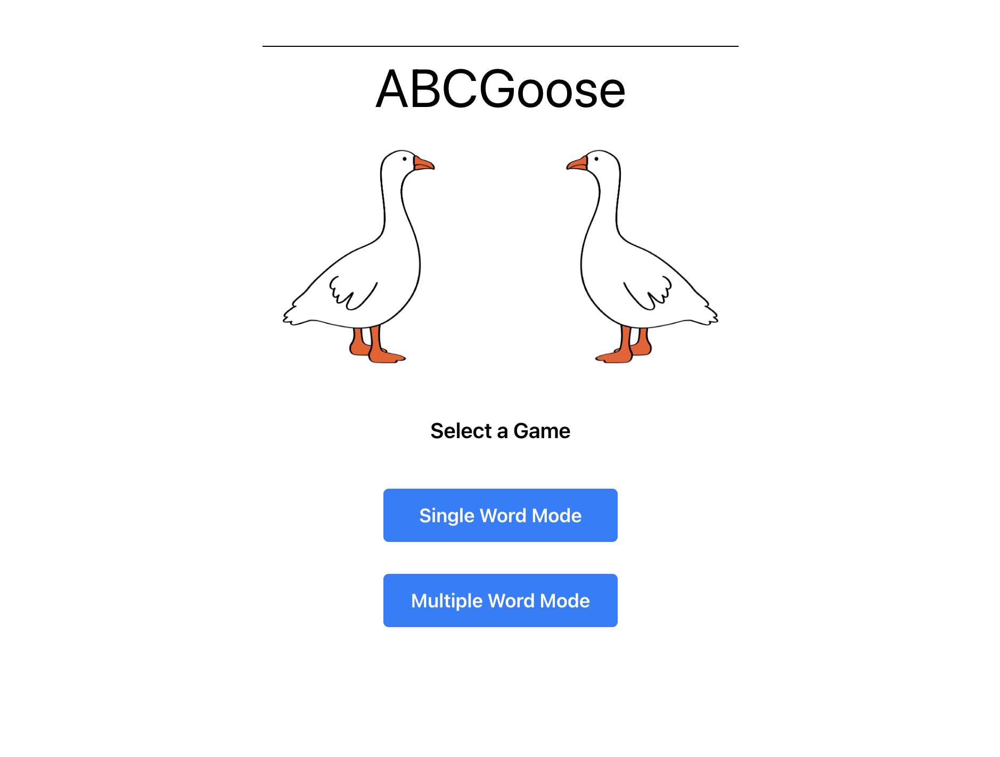
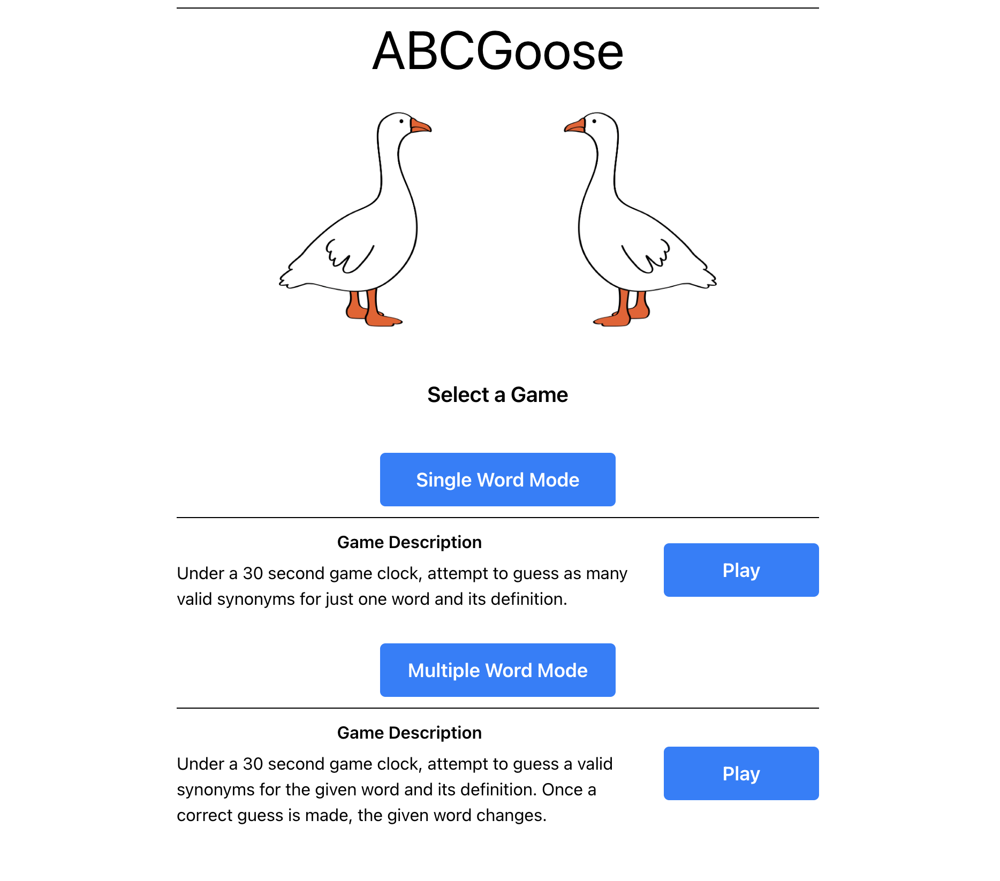
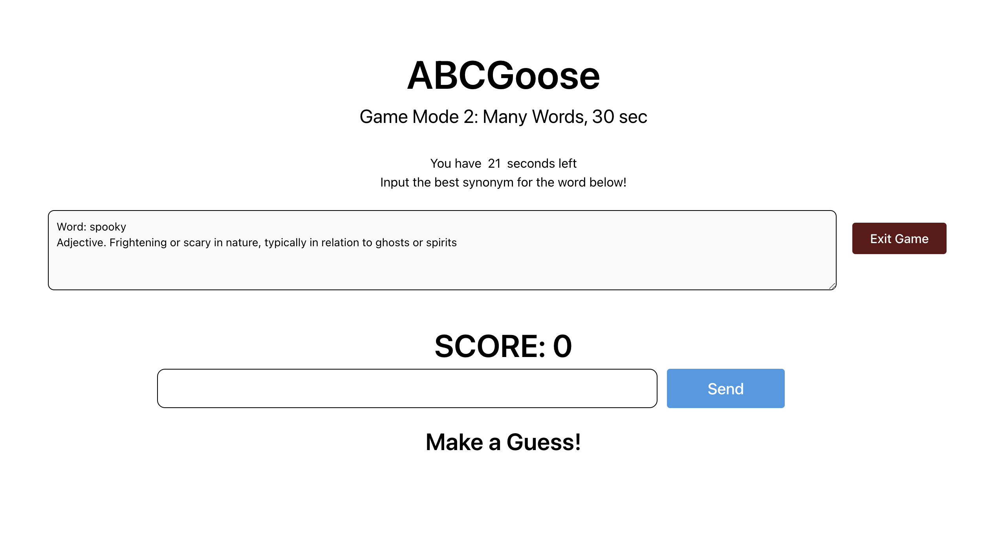
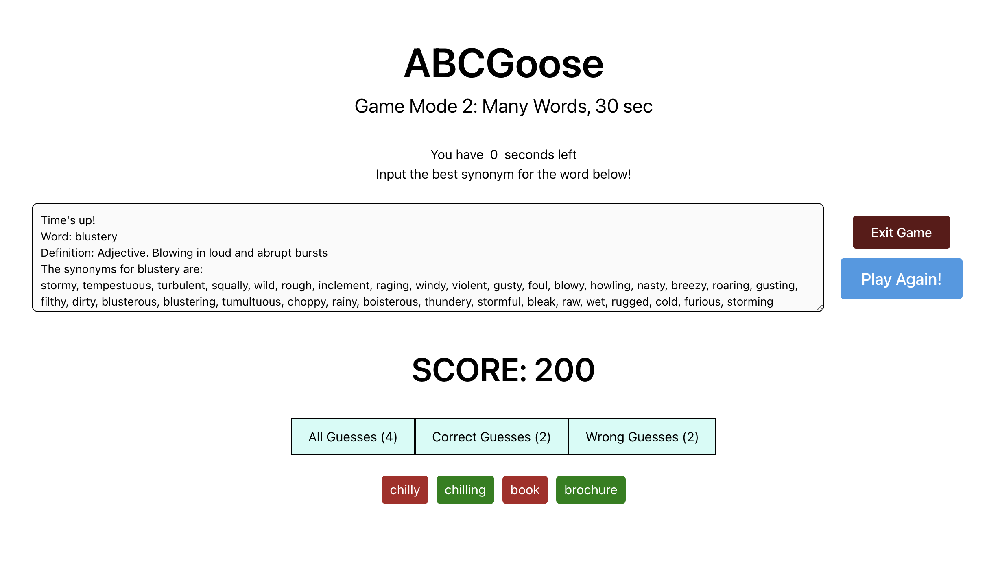
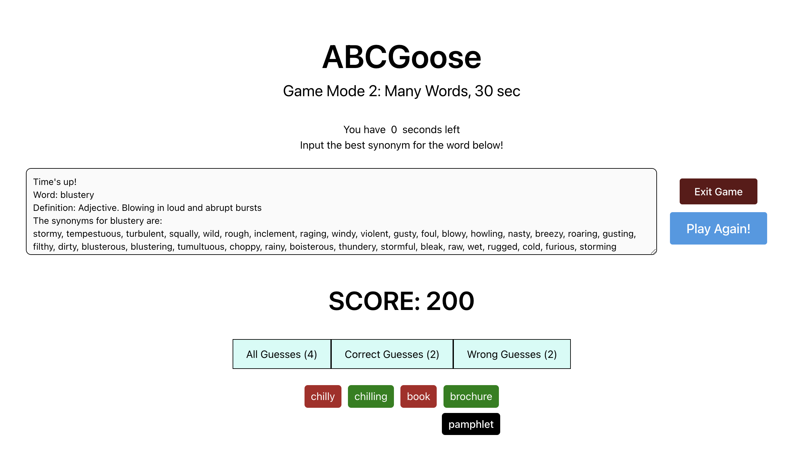

# How to Play:

There's a live website link now:
https://abcgoose.vercel.app/

Current Deployment Stack:

- Backend: Render (free tier)
- Database: Supabase (free tier)
- Frontend: Vercel (free tier)

Disclaimer: GooseGPT AI Game Mode does not work on the live link because Render runs out of memory to download the datasets for answer inference. To use GooseGPT AI, follow the Clone and Develop Locally guide below.

## Screenshots:

    
    
    
    
    

## Tasks Completed:

- Engineered, Trained, and Deployed Logistic Regression ML Model and integrated into GooseGPT AI Game Mode
- Developed fast-rendering and clean React.js + Tailwind.css frontend (model-view-controller paradigm)
- Built webscraper to reliably find words, definitions, and synonyms
- Built secure Flask backend API with Domain, SSL Certificate, and JWT token Auth to fetch game data
- Host backend on AWS EC2 and deploy frontend on Vercel

## To clone and develop locally:

1. Clone the Repository
2. Ensure you have Python, npm, and React installed on your machine
3. Follow instructions below

### Running Backend

cd ABCGoose/database

#### Set up Virtual Environment

If you don't have the pip virtualenv package, do: pip install virtualenv

python3 -m venv venv

source venv/bin/activate

pip install -r requirements.txt

./runBackend.sh

### Running Frontend

Open another terminal shell and type the following two commands\
cd ABCGoose/frontend/app \
npm start

Click the link generated by npm
